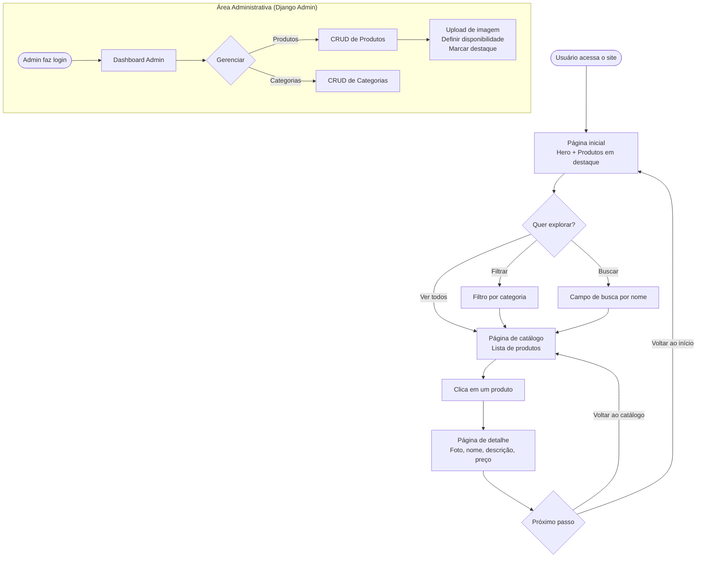
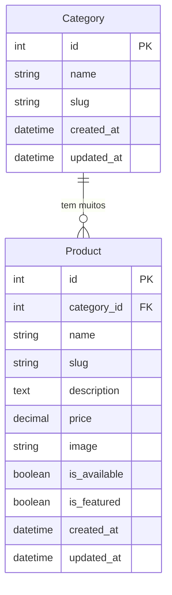

# PRD — Catálogo de Produtos de Confeitaria

> **Versão:** 1.0  
> **Data:** 2026-04-22  
> **Status:** Em elaboração

---

## 1. Visão Geral

Este documento descreve os requisitos de produto para um **catálogo digital de produtos de confeitaria**, desenvolvido com Python e Django full-stack. O sistema exibe os produtos da confeitaria de forma elegante e responsiva, permitindo que clientes conheçam o portfólio sem necessidade de autenticação, e que o administrador gerencie o catálogo pelo painel do Django Admin.

---

## 2. Sobre o Produto

O **Catálogo de Confeitaria** é uma aplicação web que apresenta os produtos de uma confeitaria artesanal — entremets, tortas, bolos e similares — com fotos, descrições, preços e categorias. O produto é simples, enxuto e focado na experiência visual do cliente.

---

## 3. Propósito

Oferecer à confeitaria uma presença digital profissional onde clientes possam visualizar o portfólio completo de produtos, com informações claras e um design que reflita a sofisticação dos produtos artesanais.

---

## 4. Público-Alvo

| Perfil | Descrição |
|---|---|
| **Clientes finais** | Pessoas interessadas em encomendas de produtos artesanais de confeitaria |
| **Administrador** | Confeiteiro(a) ou responsável que cadastra e gerencia os produtos via Django Admin |

---

## 5. Objetivos

1. Exibir o catálogo de produtos com foto, nome, descrição, preço e categoria.
2. Permitir filtragem e busca de produtos por categoria e nome.
3. Apresentar a página de detalhe de cada produto.
4. Permitir gestão completa dos produtos pelo Django Admin.
5. Garantir design responsivo, moderno e visualmente sofisticado.

---

## 6. Requisitos Funcionais

### 6.1 Funcionalidades

- **RF01** — Listagem de todos os produtos disponíveis no catálogo.
- **RF02** — Filtragem de produtos por categoria.
- **RF03** — Busca de produtos por nome.
- **RF04** — Página de detalhe do produto com foto ampliada, descrição completa e preço.
- **RF05** — Destaque de produtos marcados como "em destaque".
- **RF06** — Gestão de produtos (CRUD) via Django Admin.
- **RF07** — Gestão de categorias (CRUD) via Django Admin.
- **RF08** — Upload de imagem por produto.
- **RF09** — Indicação de disponibilidade do produto (disponível / indisponível).

### 6.2 Fluxo de UX



---

## 7. Requisitos Não-Funcionais

| ID | Requisito |
|---|---|
| **RNF01** | A interface deve ser completamente responsiva (mobile, tablet e desktop). |
| **RNF02** | O tempo de carregamento da página inicial deve ser inferior a 2 segundos em conexão padrão. |
| **RNF03** | O sistema deve usar SQLite como banco de dados. |
| **RNF04** | O código deve seguir PEP 8 e usar aspas simples. |
| **RNF05** | O sistema deve ser desenvolvido com Django full-stack e Django Template Language. |
| **RNF06** | O frontend deve usar exclusivamente TailwindCSS para estilização. |
| **RNF07** | Toda informação exibida ao usuário deve estar em português brasileiro. |
| **RNF08** | O sistema deve usar Class Based Views sempre que possível. |
| **RNF09** | Signals, se utilizados, devem residir em `signals.py` dentro da app correspondente. |
| **RNF10** | Nenhuma funcionalidade além do escopo definido deve ser implementada. |

---

## 8. Arquitetura Técnica

### 8.1 Stack

| Camada | Tecnologia |
|---|---|
| **Linguagem** | Python 3.12+ |
| **Framework web** | Django 5.x |
| **Templating** | Django Template Language (DTL) |
| **CSS** | TailwindCSS (via CDN ou django-tailwind) |
| **Banco de dados** | SQLite (padrão Django) |
| **Armazenamento de mídia** | Sistema de arquivos local (Django `MEDIA_ROOT`) |
| **Admin** | Django Admin nativo |

### 8.2 Estrutura do Projeto

```
confeitaria_catalogo/
├── manage.py
├── config/                  # Configurações do projeto Django
│   ├── settings.py
│   ├── urls.py
│   └── wsgi.py
├── catalog/                 # App principal do catálogo
│   ├── models.py
│   ├── views.py
│   ├── urls.py
│   ├── admin.py
│   ├── apps.py
│   └── templates/
│       └── catalog/
│           ├── base.html
│           ├── home.html
│           ├── product_list.html
│           └── product_detail.html
├── static/
│   └── css/
│       └── input.css
└── media/                   # Imagens enviadas pelos usuários
```

### 8.3 Estrutura de Dados (Schemas)



---

## 9. Design System

> Paleta extraída das fotografias dos produtos: fundo escuro/carvão de vitrine, chocolate quente, dourado de bandeja, creme de mousse, vermelho morango e amarelo limão.

### 9.1 Paleta de Cores (TailwindCSS — config customizado)

| Token | Hex | Uso |
|---|---|---|
| `primary` | `#6B3A2A` | Botões primários, links ativos |
| `primary-dark` | `#4A2318` | Hover de botões primários |
| `accent` | `#C9A227` | Destaques, badges, bordas decorativas |
| `background` | `#111111` | Fundo principal da página |
| `surface` | `#1E1A18` | Cards, navbar, rodapé |
| `surface-light` | `#2C2420` | Hover de cards, inputs |
| `text-primary` | `#F5E6C8` | Textos principais |
| `text-secondary` | `#A89880` | Textos secundários, placeholders |
| `border` | `#3D2E24` | Bordas sutis |
| `success` | `#4A7C59` | Disponível |
| `error` | `#CC2936` | Indisponível |

### 9.2 Gradientes

```html
<!-- Hero gradient -->
<div class="bg-gradient-to-br from-[#111111] via-[#1E1A18] to-[#2C1810]">

<!-- Card overlay gradient -->
<div class="bg-gradient-to-t from-[#111111] via-transparent to-transparent">

<!-- Accent glow -->
<div class="bg-gradient-to-r from-[#6B3A2A] to-[#C9A227]">
```

### 9.3 Tipografia

```html
<!-- Fonte principal (Google Fonts - via template base) -->
<link href="https://fonts.googleapis.com/css2?family=Playfair+Display:wght@400;600;700&family=Inter:wght@300;400;500&display=swap" rel="stylesheet">

<!-- Headings -->
<h1 class="font-['Playfair_Display'] text-4xl font-bold text-[#F5E6C8] tracking-wide">

<!-- Body -->
<p class="font-['Inter'] text-base font-light text-[#A89880] leading-relaxed">
```

### 9.4 Botões

```html
<!-- Botão primário -->
<button class="px-6 py-3 bg-[#6B3A2A] hover:bg-[#4A2318] text-[#F5E6C8] font-medium rounded-lg
               transition-all duration-200 border border-[#C9A227]/30 hover:border-[#C9A227]/60
               focus:outline-none focus:ring-2 focus:ring-[#C9A227]/50">
  Ver Catálogo
</button>

<!-- Botão secundário / outline -->
<button class="px-6 py-3 bg-transparent hover:bg-[#2C2420] text-[#C9A227] font-medium rounded-lg
               transition-all duration-200 border border-[#C9A227]/50 hover:border-[#C9A227]
               focus:outline-none focus:ring-2 focus:ring-[#C9A227]/50">
  Saiba Mais
</button>

<!-- Badge de destaque -->
<span class="px-3 py-1 bg-[#C9A227]/20 text-[#C9A227] text-xs font-medium rounded-full
             border border-[#C9A227]/40">
  Destaque
</span>

<!-- Badge disponível -->
<span class="px-3 py-1 bg-[#4A7C59]/20 text-[#4A7C59] text-xs font-medium rounded-full">
  Disponível
</span>

<!-- Badge indisponível -->
<span class="px-3 py-1 bg-[#CC2936]/20 text-[#CC2936] text-xs font-medium rounded-full">
  Indisponível
</span>
```

### 9.5 Inputs e Formulários

```html
<!-- Campo de busca -->
<input type="text"
       class="w-full px-4 py-3 bg-[#1E1A18] border border-[#3D2E24] rounded-lg
              text-[#F5E6C8] placeholder-[#A89880]
              focus:outline-none focus:border-[#C9A227]/60 focus:ring-1 focus:ring-[#C9A227]/30
              transition-colors duration-200"
       placeholder="Buscar produtos...">

<!-- Select de categoria -->
<select class="px-4 py-3 bg-[#1E1A18] border border-[#3D2E24] rounded-lg
               text-[#F5E6C8] cursor-pointer
               focus:outline-none focus:border-[#C9A227]/60
               transition-colors duration-200">
  <option>Todas as categorias</option>
</select>
```

### 9.6 Cards de Produto

```html
<!-- Card de produto -->
<div class="group bg-[#1E1A18] border border-[#3D2E24] rounded-xl overflow-hidden
            hover:border-[#C9A227]/40 transition-all duration-300 hover:-translate-y-1
            hover:shadow-lg hover:shadow-[#C9A227]/5">

  <!-- Imagem -->
  <div class="relative overflow-hidden aspect-square">
    
    <!-- Overlay gradient -->
    <div class="absolute inset-0 bg-gradient-to-t from-[#111111]/60 to-transparent opacity-0
                group-hover:opacity-100 transition-opacity duration-300"></div>
  </div>

  <!-- Conteúdo -->
  <div class="p-4">
    <span class="text-xs text-[#C9A227] font-medium uppercase tracking-wider">Categoria</span>
    <h3 class="mt-1 font-['Playfair_Display'] text-lg text-[#F5E6C8] font-semibold">Nome</h3>
    <p class="mt-2 text-sm text-[#A89880] line-clamp-2">Descrição breve do produto.</p>
    <div class="mt-4 flex items-center justify-between">
      <span class="font-['Playfair_Display'] text-xl text-[#C9A227] font-bold">R$ 00,00</span>
    </div>
  </div>
</div>
```

### 9.7 Grid de Produtos

```html
<!-- Grid responsivo -->
<div class="grid grid-cols-1 sm:grid-cols-2 lg:grid-cols-3 xl:grid-cols-4 gap-6">
  <!-- cards aqui -->
</div>
```

### 9.8 Navbar

```html
<nav class="sticky top-0 z-50 bg-[#111111]/90 backdrop-blur-md border-b border-[#3D2E24]">
  <div class="max-w-7xl mx-auto px-4 sm:px-6 lg:px-8 flex items-center justify-between h-16">
    <!-- Logo / Nome da confeitaria -->
    <span class="font-['Playfair_Display'] text-xl font-bold text-[#C9A227] tracking-wide">
      Nome da Confeitaria
    </span>
    <!-- Links -->
    <div class="flex gap-6">
      <a href="/" class="text-[#A89880] hover:text-[#F5E6C8] transition-colors text-sm font-medium">Início</a>
      <a href="/catalogo/" class="text-[#A89880] hover:text-[#F5E6C8] transition-colors text-sm font-medium">Catálogo</a>
    </div>
  </div>
</nav>
```

### 9.9 Rodapé

```html
<footer class="bg-[#1E1A18] border-t border-[#3D2E24] py-8 mt-16">
  <div class="max-w-7xl mx-auto px-4 text-center">
    <p class="font-['Playfair_Display'] text-[#C9A227] text-lg font-semibold">Nome da Confeitaria</p>
    <p class="mt-2 text-sm text-[#A89880]">Feito com carinho.</p>
  </div>
</footer>
```

---

## 10. User Stories

### Épico 1 — Exploração do Catálogo (Cliente)

---

**US-01 — Ver produtos em destaque na página inicial**

> *Como cliente, quero ver os produtos em destaque na página inicial, para que eu seja apresentado rapidamente aos melhores produtos da confeitaria.*

**Critérios de aceite:**
- [ ] A página inicial exibe uma seção "Destaques" com os produtos marcados como `is_featured=True`.
- [ ] Cada card de destaque exibe foto, nome, categoria e preço.
- [ ] A seção é visualmente diferenciada do restante da página.
- [ ] Se não houver produtos em destaque, a seção não é renderizada.

---

**US-02 — Listar todos os produtos**

> *Como cliente, quero acessar a listagem completa de produtos, para que eu possa explorar todo o catálogo.*

**Critérios de aceite:**
- [ ] A rota `/catalogo/` exibe todos os produtos com `is_available=True`.
- [ ] Os produtos são exibidos em grid responsivo.
- [ ] Cada card exibe foto, nome, categoria, preço e status de disponibilidade.
- [ ] Produtos indisponíveis podem ser exibidos com indicação visual de indisponibilidade.

---

**US-03 — Filtrar produtos por categoria**

> *Como cliente, quero filtrar os produtos por categoria, para que eu encontre rapidamente o tipo de produto que procuro.*

**Critérios de aceite:**
- [ ] A página de catálogo exibe as categorias disponíveis como filtros.
- [ ] Ao selecionar uma categoria, apenas os produtos daquela categoria são exibidos.
- [ ] A categoria ativa é visualmente destacada.
- [ ] Ao selecionar "Todas", todos os produtos são exibidos.

---

**US-04 — Buscar produtos por nome**

> *Como cliente, quero buscar produtos pelo nome, para que eu encontre um produto específico rapidamente.*

**Critérios de aceite:**
- [ ] A página de catálogo possui um campo de busca por texto.
- [ ] A busca filtra produtos cujo nome contenha o termo digitado (case-insensitive).
- [ ] Se nenhum produto for encontrado, uma mensagem informativa é exibida.
- [ ] A busca e o filtro de categoria podem ser combinados.

---

**US-05 — Ver detalhe de um produto**

> *Como cliente, quero ver a página de detalhe de um produto, para que eu possa ver a foto ampliada, a descrição completa e o preço.*

**Critérios de aceite:**
- [ ] A rota `/catalogo/<slug>/` exibe a página de detalhe do produto.
- [ ] A página exibe foto ampliada, nome, categoria, preço, descrição completa e status de disponibilidade.
- [ ] Há um link de retorno ao catálogo.
- [ ] Produtos inexistentes retornam 404.

---

### Épico 2 — Gestão do Catálogo (Administrador)

---

**US-06 — Cadastrar produto**

> *Como administrador, quero cadastrar um novo produto via Django Admin, para que ele apareça no catálogo.*

**Critérios de aceite:**
- [ ] O Django Admin permite criar um produto com todos os campos necessários.
- [ ] O upload de imagem funciona corretamente.
- [ ] O slug é gerado automaticamente a partir do nome.
- [ ] O produto salvo aparece na listagem do catálogo.

---

**US-07 — Editar produto**

> *Como administrador, quero editar um produto existente, para corrigir ou atualizar suas informações.*

**Critérios de aceite:**
- [ ] O Django Admin permite editar todos os campos de um produto existente.
- [ ] As alterações são refletidas imediatamente no catálogo.
- [ ] O campo `updated_at` é atualizado automaticamente.

---

**US-08 — Gerenciar categorias**

> *Como administrador, quero criar e editar categorias, para organizar os produtos do catálogo.*

**Critérios de aceite:**
- [ ] O Django Admin permite criar, editar e excluir categorias.
- [ ] O slug da categoria é gerado automaticamente.
- [ ] Ao excluir uma categoria que possui produtos, os produtos não são excluídos (proteção).

---

## 11. Métricas de Sucesso

### KPIs de Produto

| KPI | Descrição | Meta inicial |
|---|---|---|
| **Catálogo populado** | Número de produtos cadastrados | ≥ 10 produtos |
| **Categorias organizadas** | Número de categorias ativas | ≥ 3 categorias |
| **Cobertura de imagens** | % de produtos com foto | 100% |

### KPIs de Usuário

| KPI | Descrição |
|---|---|
| **Taxa de cliques em detalhe** | % de usuários que acessam a página de detalhe de algum produto |
| **Engajamento com filtros** | % de sessões que utilizam filtro de categoria ou busca |
| **Taxa de rejeição** | % de usuários que saem sem interagir |

### KPIs Técnicos

| KPI | Meta |
|---|---|
| **Tempo de carregamento (LCP)** | < 2s |
| **Responsividade** | 100% das páginas funcionais em mobile |
| **Erros 500** | 0 em produção |

---

## 12. Riscos e Mitigações

| Risco | Probabilidade | Impacto | Mitigação |
|---|---|---|---|
| Imagens de produtos com tamanho excessivo degradando performance | Média | Alto | Definir limite de tamanho no upload e usar `object-cover` no template |
| Design inconsistente entre páginas | Baixa | Médio | Criar `base.html` centralizado com todos os componentes de layout |
| Slug duplicado causando erro no banco | Baixa | Alto | Usar `slugify` com sufixo único ou `unique=True` no campo slug |
| Admin exposto sem senha segura em produção | Alta | Crítico | Orientar uso de senha forte e restrição de acesso por IP em produção |
| Produto sem imagem quebrando o layout | Média | Médio | Definir imagem padrão (placeholder) via condicional no template |

---

*Documento gerado em 2026-04-22.*
